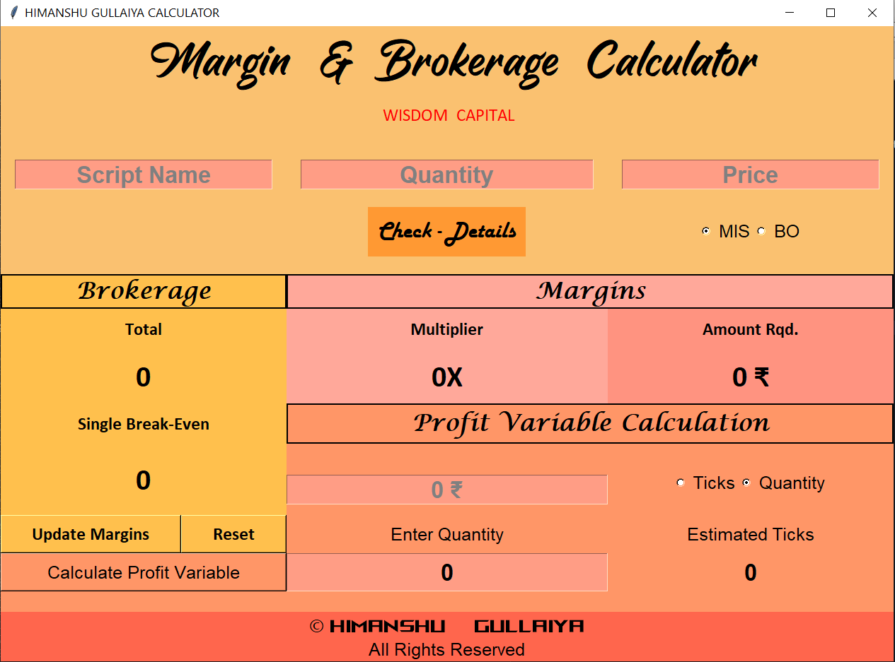
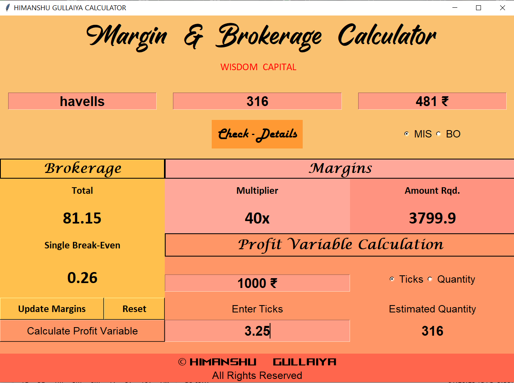

# Margin & Brokerage Calculator

This widget is a life saver, and is packed with following Feautures:
* Brokerage Charges
* Breakeven Charge
* Margin Provided by the Broker
* Cash Required to buy equity stock

## PROFIT VARIABLE CALC.
* Enter the Amount you want to earn and choose the following:
* Either Quantity or Ticks
* <b>Quantity</b> - Enter the Quantity & the Calc. will tell you approx. target move per share
* <b>Ticks</b> - Provide the move, & calc. will tell you the quantity required to achieve profit

# UPDATES
* update the Margins

# RESET
* reset the fields

